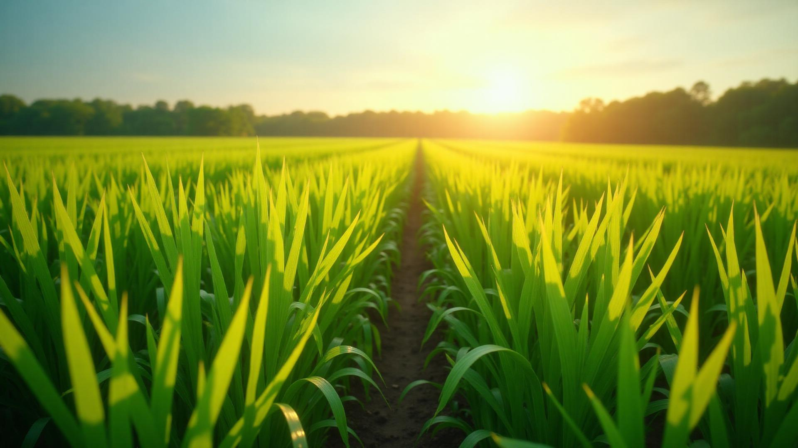

<p align="center">
  
</p>

<h1 align="center">AgurateAI</h1>

<p align="center">
  <strong>AI-assisted crop health intelligence for the Louisiana Delta</strong>
</p>

<p align="center">
  Closed beta · Research-framed decision aid · Built for rice, soybean, cotton &amp; corn growers
</p>

<p align="center">
  <a href="https://lovable.dev/projects/c684f21a-ff17-4d6d-a950-d5d66668838f">Lovable Project</a>
  ·
  <a href="docs/PRODUCTION-SHIPPING-CHECKLIST.md">Shipping Checklist</a>
  ·
  <a href="docs/PRE-LAUNCH-CRITICAL-TASKS.md">Pre-Launch Tasks</a>
  ·
  <a href="mailto:support@agurateai.com">support@agurateai.com</a>
</p>

---

<p align="center">
  
</p>

<p align="center">
  <em>Home hero imagery used across the AgurateAI experience</em>
</p>

---

## What is AgurateAI?

**AgurateAI** is a web application that helps Louisiana Delta farmers assess crop health, organize field history, and explore research-oriented insights for rice, soybean, cotton, and corn.

Growers can photograph plants in the field, get AI-assisted analysis framed as a research decision aid (not a validated diagnosis), track observations over time, explore conservation and water-stress context, and connect with LSU AgCenter researcher directory information.

The product is currently in **closed beta**. Access is invite- or signup-gated while we harden security, authenticity of claims, and production operations.

### Purpose

| Goal | How AgurateAI helps |
|------|---------------------|
| Faster field assessment | Capture crop photos and review AI-assisted health scores and observations |
| Continuity across seasons | Keep scan history, field notes, and documentation in one place |
| Local relevance | Surface Delta-focused guidance, variety context, and researcher directory links |
| Honest decision support | Present insights as research framing — not official diagnosis or guaranteed outcomes |

> **Honesty note:** AgurateAI is **not** an official LSU AgCenter product or partner endorsement, and outputs are **not** a substitute for certified agronomic diagnosis. Marketing and UI copy are intentionally conservative about accuracy, offline capability, and ROI claims.

---

## Product snapshot

<p align="center">
  
</p>

---

## Features

Core capabilities available in the closed-beta experience:

| Feature | Description |
|---------|-------------|
| **AI Crop Scanner** | Photograph plants in the field and receive AI-assisted health scoring with observations |
| **Predictive Analytics** | Explore scenario-style questions about conditions and management choices |
| **Delta Intelligence Chat** | Ask Louisiana Delta–focused crop and conservation questions |
| **Water Stress & DIRT** | Deep-dive views for water-stress context and DIRT-related exploration |
| **Conservation Tracking** | Log and review conservation-oriented field activity |
| **Variety Recommendations** | Browse variety context aligned to Delta crop systems |
| **LSU Researcher Directory** | Find AgCenter researcher directory entries (privacy-conscious listings) |
| **Community Intelligence** | Share and learn from regional grower signal (beta-scoped) |
| **Interactive Field Maps** | Map fields and relate scans to locations |
| **Insurance Documentation** | Generate documentation-oriented exports for records |

Supporting product surfaces include dashboard history, upload flows, PWA install support, and beta signup / invitation join paths.

---

## Who it's for

- **Louisiana Delta growers** evaluating rice, soybean, cotton, or corn stands
- **Closed-beta invitees** validating field workflows before wider release
- **Operators / co-ops** exploring multi-user access paths (cooperative plan inquiries via support)

---

## Tech stack

| Layer | Choice |
|-------|--------|
| UI | React 18, TypeScript, Vite, Tailwind CSS, shadcn/ui |
| Backend | Supabase (Auth, Postgres + RLS, Edge Functions, Storage) |
| Maps / media | Interactive field maps, crop image storage, PDF generation |
| Quality | Vitest, Playwright honesty smoke, static honesty scanner, Deno edge typecheck |
| Hosting / edit | [Lovable](https://lovable.dev/projects/c684f21a-ff17-4d6d-a950-d5d66668838f) + this GitHub repository |

---

## Quick start

### Prerequisites

- Node.js 20+
- npm
- A Supabase project (URL + publishable/anon key)

### Setup

```sh
git clone https://github.com/ConWan30/Agurate_AI.git
cd Agurate_AI
npm install
cp .env.example .env
```

Fill `.env` from `.env.example`:

```env
VITE_SUPABASE_URL=https://YOUR_PROJECT.supabase.co
VITE_SUPABASE_PUBLISHABLE_KEY=YOUR_SUPABASE_ANON_OR_PUBLISHABLE_KEY
VITE_SUPABASE_PROJECT_ID=YOUR_PROJECT_ID
```

### Run locally

```sh
npm run dev
```

App defaults to **http://localhost:8080**.

### Useful scripts

| Command | Purpose |
|---------|---------|
| `npm run typecheck` | TypeScript (`tsc --noEmit`) |
| `npm run test:ci` | Unit tests (Vitest) |
| `npm run verify:honesty:static` | Static banned-claim scan (`src` + edge functions) |
| `npm run check:edge` | Deno check for Supabase Edge Functions |
| `npm run test:e2e:honesty` | Playwright public-copy honesty smoke |
| `npm run build` | Production build |

CI runs these gates on pull requests (see `.github/workflows/ci.yml`).

---

## Documentation & links

| Resource | Link |
|----------|------|
| Repository | https://github.com/ConWan30/Agurate_AI |
| Lovable editor / project | https://lovable.dev/projects/c684f21a-ff17-4d6d-a950-d5d66668838f |
| Production shipping checklist | [docs/PRODUCTION-SHIPPING-CHECKLIST.md](docs/PRODUCTION-SHIPPING-CHECKLIST.md) |
| Pre-launch critical tasks | [docs/PRE-LAUNCH-CRITICAL-TASKS.md](docs/PRE-LAUNCH-CRITICAL-TASKS.md) |
| Environment template | [.env.example](.env.example) |
| Support | [support@agurateai.com](mailto:support@agurateai.com) |
| Product site (referenced in-app) | https://agurateai.com |

### Edit with Lovable

Open the [Lovable project](https://lovable.dev/projects/c684f21a-ff17-4d6d-a950-d5d66668838f), prompt changes, and sync back to this repo via GitHub.

### Edit locally

Clone, install, configure `.env`, then `npm run dev` as above. Commit and push; Lovable can pull from GitHub when connected.

---

## Project layout (high level)

```text
src/                 React app (pages, components, hooks, lib)
public/              PWA icons, favicon, brand screenshot asset
supabase/
  functions/         Edge Functions (AI analysis, beta signup, etc.)
  migrations/        Postgres + RLS schema history
docs/                Shipping and launch checklists
e2e/                 Playwright honesty / smoke specs
scripts/             Honesty verifiers and edge check helpers
```

---

## Security & privacy (summary)

- Do **not** commit real `.env` secrets; use `.env.example` only.
- Supabase **RLS** protects user data; catalog and researcher listings are intentionally scoped.
- Crop images use ownership-aware storage paths.
- Edge functions apply shared auth helpers and rate limiting (including durable IP limits for sensitive public endpoints).
- Demo / integration routes are gated to development builds where applicable.

See the shipping checklist for production steps that still require dashboard credentials (migrations, Auth leaked-password protection, edge deploy, live smoke).

---

## Status

**Closed beta — launch-readiness work in progress.**

In-repo quality gates (typecheck, unit tests, honesty static scan, edge check, Playwright honesty, production build) are maintained on this branch. Remote production cutover (apply migrations, deploy functions, publish, live URL smoke) still depends on operator credentials outside this repository.

---

<p align="center">
  
  <br />
  <sub>AgurateAI · Louisiana Delta crop intelligence</sub>
</p>
